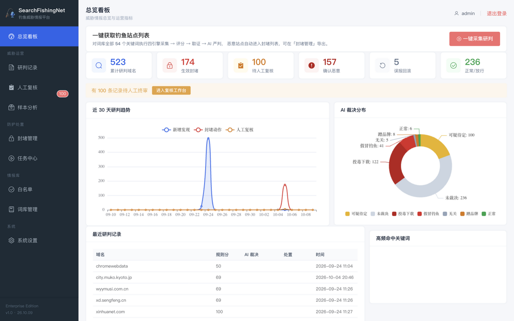
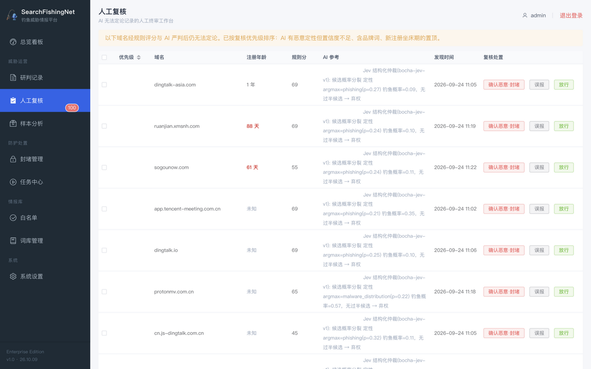
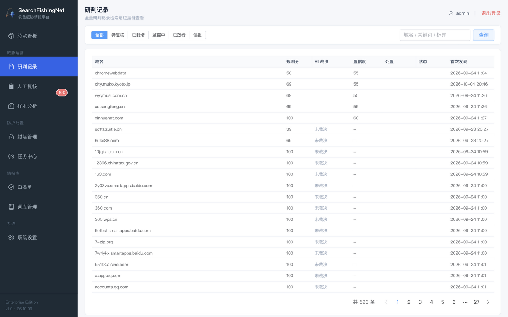
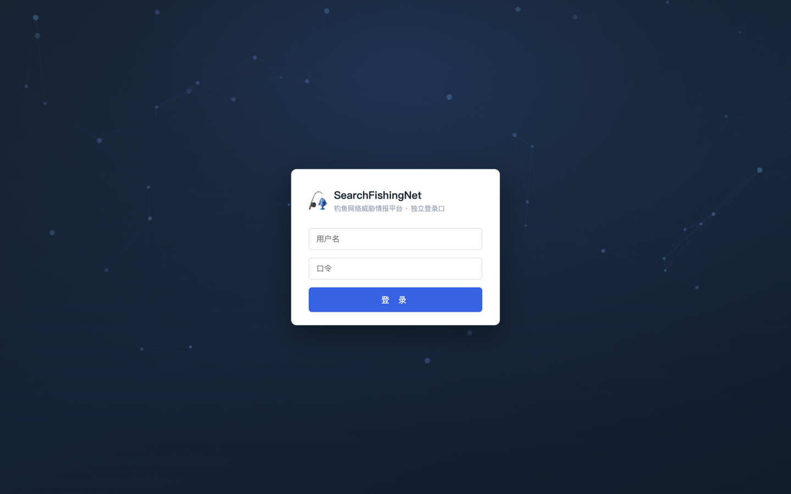
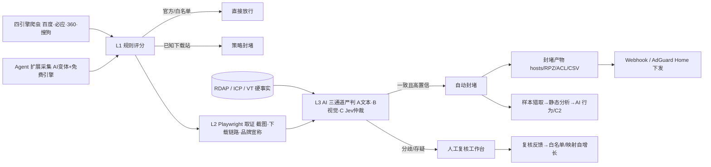

<div align="center">
  <h1>🎣 SearchFishingNet</h1>
  <p><strong>面向企业防守的搜索引擎钓鱼威胁情报与银狐投毒防护平台</strong></p>
  <p>SearchFishingNet 以本地品牌官方域名映射为一票通过事实源，通过四引擎采集、Agent 变体扩展、动态取证、AI 三通道严判、硬事实核验、载荷猎取与 DNS 封堵，把银狐木马借 SEO 投毒伪造软件官网（钉钉 / 向日葵 / ToDesk / 用友 / 电子税务局）的攻击流量，收敛成一条可审计、可回滚、可下发的威胁情报闭环。</p>

  <p>
    
    
    
    
    
    
    
  </p>

  <p>
    <a href="#项目介绍">项目介绍</a> ·
    <a href="#核心特性">核心特性</a> ·
    <a href="#研判实测">研判实测</a> ·
    <a href="#界面预览">界面预览</a> ·
    <a href="#系统架构">系统架构</a> ·
    <a href="#典型用途">典型用途</a> ·
    <a href="#快速开始">快速开始</a> ·
    <a href="#目录结构">目录结构</a>
  </p>
</div>

---

> ⚠️ **使用声明**：本项目面向企业防守场景（钓鱼威胁情报与投毒防护），请在**自有授权环境**内使用。平台具备恶意载荷自动猎取与隔离能力（全流程零执行），请仅在具备恶意样本处置条件的环境中部署。

## 项目介绍

SearchFishingNet 是一套面向安全值守、威胁情报运营与 DNS 防护团队的钓鱼站点情报平台。它不是一个关键词黑名单工具，而是一条可以嵌入现有 DNS 防护体系的 **threat intelligence pipeline**：以本地品牌官方域名映射（50+ 品牌/63+ 官方域，最长后缀匹配）为**一票通过事实源**，对抗 GEO 投毒时代"AI 联网搜索结果被黑灰产污染"的新攻击面——搜索引擎头部结果本身已不可信，平台只信硬事实。

平台的核心研判管线是**三级漏斗**：L1 规则评分（官方映射一票通过、严格官方放行策略、分发渠道因子、相似度/RDAP/TLD）→ L2 动态取证（Playwright 截图、下载链路分析、网盘/短链标记、品牌宣称识别）→ L3 AI 三通道严判（文本推理通道A + 截图核验通道B + Jev 结构化仲裁通道C）。三通道结论按一致性合并：一致采信、分歧取更严重定性并压置信度转人工、置信度 0 视为无效信号、概率分裂视为弃权——把"AI 裁决可审计、可降级、可回滚"当作第一原则。

平台围绕 **域名、搜索语境、取证证据、下载链路、硬事实（RDAP 注册年龄/ICP 备案/VirusTotal）、样本行为、C2 候选** 建模，把"一个可疑搜索结果"收敛成从首次发现到封堵下发、从载荷隔离到行为推断的完整证据链。误报回滚自动回流白名单与官方映射候选（安全闸三连：AI 恶意嫌疑排除/坐床期排除/分发页排除），让词库随运营自然长厚。

## 核心特性

- **严格官方放行策略**：只有品牌官方域名与人工审定白名单自动放行，其余域名一律封顶 69 分进入取证与 AI 研判漏斗；已知第三方下载站直接策略封堵（银狐的主要分发渠道）。
- **AI 三通道严判**：任意 OpenAI 兼容推理模型（通道A）+ 视觉模型截图核验（通道B）+ Jev 结构化仲裁（通道C，TypeSafe SystemOne 协议）；概率型模型不输出证据引用、单独兜底时置信度封顶不触发自动封堵。
- **免费模型可全量运行**：网关侧限时免费模型（如 bocha-jev-v1 仲裁 ~25ms/次、spark 类 4B 主判）即可驱动整条漏斗；额度耗尽自动降级、连续失败进入熔断冷却窗。
- **硬事实核验**：RDAP 注册年龄（免费无 Key）随研判自动采集入库；ICP 备案与 VirusTotal 填 Key 即启用；坐床期新注册（<90 天）与老域名（>5 年）在 AI 材料包中分别给出解读提示。
- **样本分析**：从已封堵站点自动猎取载荷（64MB 上限、网盘跳过、存证无直链自动重访）或人工上传；纯标准库静态分析（PE 头/导入表能力信号/熵/字符串 IOC，IP 提取带 OID 防误报）+ AI 行为链与 C2 候选推断（每条 C2 强制字符串证据），样本 SHA256 隔离、全流程零执行。
- **Agent 扩展采集**：AI 把"钉钉下载"扩展成真实黑产定向变体（"激活版免注册下载"等），免费引擎（必应中国/DDG 双回退）检索后进入同一研判漏斗——SEO 头部结果之外的第二增长曲线。
- **复核工作台**：复核优先级排序（AI 恶意嫌疑+品牌词+坐床期置顶，实测 101 条积压收敛为 1 高/22 中/78 低）、多选批量处置、误报一键回流白名单。
- **官方映射自增长**：从 AI 放行/复核记录提取"页面宣称品牌但缺映射"的候选，人工一键确认即成最高优先级事实源并自动放行——误报的根治闭环。
- **设备接管**：封堵产物（hosts/dnsmasq/RPZ/ACL/CSV/TXT/JSON）之外，封堵工单可直接下发通用 Webhook 或 AdGuard Home 订阅。
- **企业级运营台**：FastAPI + SSE 任务系统、独立登录口认证（加盐哈希/会话 Cookie/Bearer 旁路）、分组导航、趋势看板与人机一致率度量。

---

## 研判实测

以下为平台在真实采集数据上的实测研判结果（517 个活跃域名、AI 三通道全量重判）：

| 场景 | 输入信号 | 三通道结论 | 最终处置 |
| --- | --- | --- | --- |
| 投毒下载链 | 飞书品牌词 + 网盘分发 + 新注册 | 恶意（含 Jev 仲裁 p=0.99） | **自动封堵** + 载荷猎取（6.8MB 高速下载器，熵 7.01） |
| 伪造备案仿冒 | WPS 官网标题 + 假 ICP 备案 + 本站托管下载 | malware_distribution/85（通道A/B 一致） | **自动封堵** |
| 坐床期钓鱼 | "搜狗"词根 + 注册 61 天 + "站点创建成功"占位页 | Jev 仲裁 phishing 高概率，主通道存疑 | **保守转人工**（坐床期站点，尚未挂马） |
| 跨语种撞名噪声 | "向日葵"命中日本向日市政府官网 | 主可疑/55 + Jev unrelated/89 分歧 | **保守转人工**（零误封） |
| 误报护栏 | drivergenius.com：2004 年注册的正版站缺映射 | AI 恶意/84 → 人工推翻 | **回滚 + 白名单 + 映射候选** |
| 样本 C2 误报修正 | OpenSSL OID 串被 IP 正则截断为 C2 | 前后向断言修正后 C2 归零 | 诚实结论："加壳未暴露明文 C2" |

漏斗累计产出：**517 活跃域名 → 236 放行 / 174 封堵 / 100 待复核 / 17 策略封堵 / 8 监控**；全部封堵记录带完整证据链（截图/下载链路/AI 证据引用/人工结论）可导出。

## 界面预览

> 以下截图均为运行实拍（1440×900 真实浏览器窗口，非设计稿）。

<table>
  <tr>
    <td width="50%" align="center">
      <strong>总览看板</strong><br>
      
      <br><sub>运营指标、待复核行动提醒（含 AI 漏判预警）、30 天三线趋势与人机一致率。</sub>
    </td>
    <td width="50%" align="center">
      <strong>人工复核工作台</strong><br>
      
      <br><sub>复核优先级排序、注册年龄坐床期高亮、AI 证据引用与批量处置。</sub>
    </td>
  </tr>
  <tr>
    <td width="50%" align="center">
      <strong>研判记录</strong><br>
      
      <br><sub>处置快捷页签与全量记录检索，点行进入完整证据链详情。</sub>
    </td>
    <td width="50%" align="center">
      <strong>独立登录口</strong><br>
      
      <br><sub>后台字节不下发给未登录浏览器；HttpOnly 会话 + Bearer 机器旁路。</sub>
    </td>
  </tr>
</table>

---

## 系统架构



核心运行链路：

1. 四引擎爬虫与 Agent 扩展采集产出候选域名（同域合并、断点续跑）。
2. L1 以官方域名为一票通过事实源评分；严格策略下非官方域名一律进漏斗。
3. L2 Playwright 取证落地页截图、下载入口（网盘/短链/站外标记）与页面品牌宣称。
4. 硬事实（RDAP/ICP/VT）与取证证据共同构成 AI 材料包，三通道独立裁决后一致性合并。
5. 高置信恶意自动封堵并生成 DNS 产物；存疑/分歧保守转人工，反馈自动回流白名单与映射候选。
6. 已封堵站点可继续猎取载荷做静态分析、AI 行为推断与 C2 挖掘，工单下发至防火墙/DNS。

更多设计细节见：[docs/DESIGN.md](docs/DESIGN.md)（评分模型 / 研判规则 / 多模型接入 / 路线图）。

---

## 典型用途

1. **银狐投毒专项防护**：针对财税/办公/远程控制软件官网仿冒的高频投放，建立"发现→研判→封堵→取证"自动闭环。
2. **DNS 层威胁情报供给**：导出 hosts/dnsmasq/RPZ/ACL 产物或经 Webhook/AdGuard Home 下发，对接现有上网出口防护。
3. **钓鱼站点情报运营**：复核优先级 + 批量处置 + 误报回流，让人工精力只花在 AI 拿不准的记录上。
4. **恶意载荷取证**：从投毒站猎取安装包做静态分析与 AI 行为/C2 推断，样本隔离不落地执行。
5. **AI 研判能力评估**：人机一致率、AI 漏判/过严分列度量，训练对 JSONL 导出供专家模型微调。
6. **新注册域名监控**：RDAP 注册年龄 + 品牌词 + 下载链路的组合信号，捕捉坐床期钓鱼站。

## 目录结构

```text
SearchFishingNet/
├── fishingnet/            # 核心引擎（无框架依赖，可独立复用）
│   ├── pipeline.py        #   采集→研判主流程（断点续跑）
│   ├── scoring.py         #   L1 评分（官方映射/渠道因子/相似度/RDAP）
│   ├── evidence.py        #   L2 Playwright 取证（截图/下载链路/品牌宣称）
│   ├── ai_judge.py        #   L3 三通道严判 + 一致性合并 + 专家范例 few-shot
│   ├── ai_client.py       #   OpenAI 兼容 + Jev TypeSafe 协议适配
│   ├── facts.py           #   RDAP/ICP/VT 硬事实 + 复核优先级
│   ├── sample_hunter.py   #   载荷猎取（隔离区/64MB 上限/零执行）
│   ├── static_analysis.py #   纯标准库静态分析（PE/导入表/IOC）
│   ├── agent_expand.py    #   AI 变体扩展 + 免费引擎检索
│   └── dispatch.py        #   封堵工单下发（Webhook/AdGuard Home）
├── backend/app/           # FastAPI 平台（任务系统/SSE/独立登录口认证）
├── frontend/              # Vue 3 + TypeScript + Element Plus 运营台
├── Browser Web Crawler/   # 四引擎浏览器爬虫（百度/必应/360/搜狗）
├── docs/                  # 设计文档与实拍截图
├── run_pipeline.py        # CLI 入口
└── samples/               # 演示用爬虫结果样例
```

## 快速开始

### 环境要求

- **操作系统**：macOS / Linux（Windows 建议 WSL2）
- **Python**：3.13（后端）；**Node**：18+（仅前端构建时需要）
- **Playwright**：首次运行 `python -m playwright install chromium --only-shell`（取证截图用）
- **AI**：任意 OpenAI 兼容服务（配置入口：系统设置 → AI 严判接入）；未配置时全量降级人工复核，绝不自动封堵

### 部署

```bash
# 1) 后端
cd backend
python3.13 -m venv .venv && .venv/bin/pip install -r requirements.txt
./.venv/bin/python run.py                  # http://0.0.0.0:8765

# 2) 前端（构建产物由后端托管）
cd frontend && npm install && npm run build

# 3) 打开 http://127.0.0.1:8765
```

| 项目 | 信息 |
|---|---|
| 登录地址 | `http://<主机>:8765/login`（独立登录口） |
| 默认账号 | `admin` |
| 默认口令 | `admin`（**首次部署请立即在系统设置 → 账号安全修改**） |

运行数据（情报库/凭据/样本隔离区）位于 `data/`，不入版本库，首次启动自动重建。

## License

[MIT](LICENSE) —— 欢迎企业安全团队自用与二次开发，Issue / PR 欢迎。
